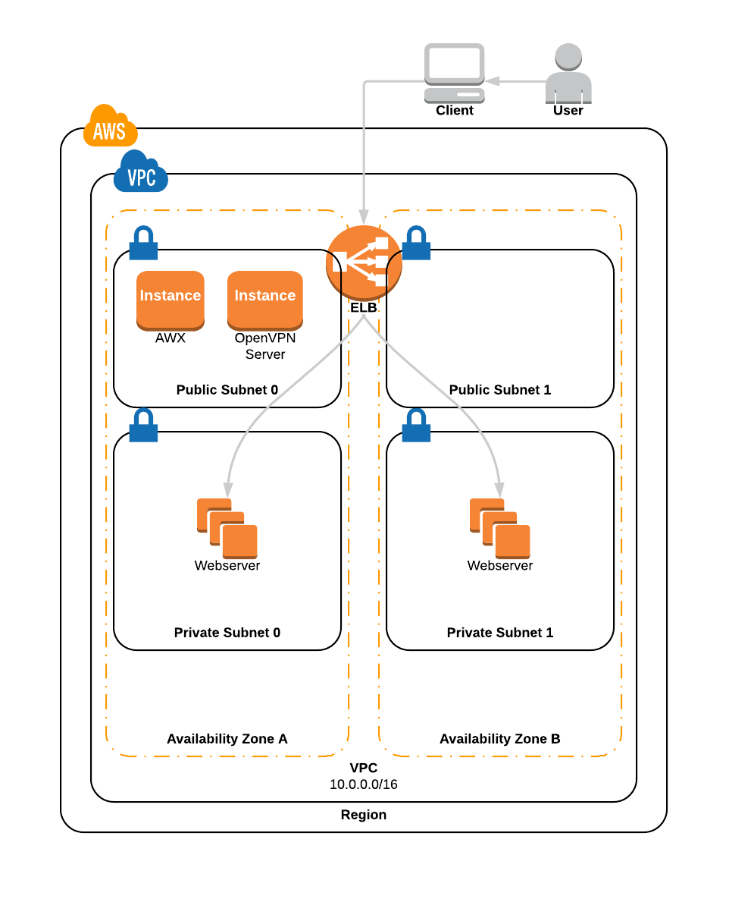

# DevOps Lab

The devops lab page can be access at <https://devops.yankurniawan.com>.

The CloudFormation templates can be found in [cf-template](cf-template) folder.
- `network.yml` contains the network resources (VPC, Subnets, internet gateway, NAT gateway, security groups)
- `app.yml` contains the application resources (ASG, launch config, ELB, OpenVPN server, ELB DNS record)

Config management is done using Ansible AWX. Each time a new EC2 instance launched by ASG, it will contact AWX using AWX callback API. AWX will configure the new instance (install packages and configure the webserver).

`web.yml` is the Ansible playbook that configures instances.

The Ansible roles can be found in [roles](roles) folder. 

The webserver instances are located in the private subnets. To access the EC2 instances via SSH, connect to the VPN server first. 

Open <https://13.55.74.255:943> to login to the OpenVPN Access Server. You can use any OpenVPN client to connect.

